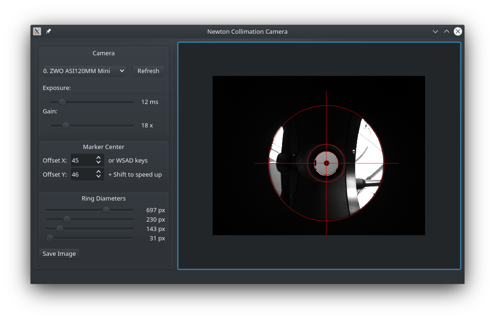

# Newton Collimation Camera

The program allows you to collimate Newton systems telescopes using a ZWO camera with a 2.1mm lens.
Newton Collimation Camera displays the image from ZWO cameras and applies adjustable markers.

## Features
- camera selection (only ZWO)
- exposure and gain control to bring out the details
- zoomable, movable preview with mouse gestures
- movable cross with the keys W, A, S, D
- adjustable ring sizes (possible with the arrow keys on the keyboard)
- automatic saving of settings
- button to save a photo with markers



## Get the code and build
```
cd ~/Projects
git clone https://github.com/pawel-soja/NewtonCollimationCamera

mkdir -p ~/Projects/build/NewtonCollimationCamera
cd ~/Projects/build/NewtonCollimationCamera
qmake ~/Projects/NewtonCollimationCamera
make -j4
```
